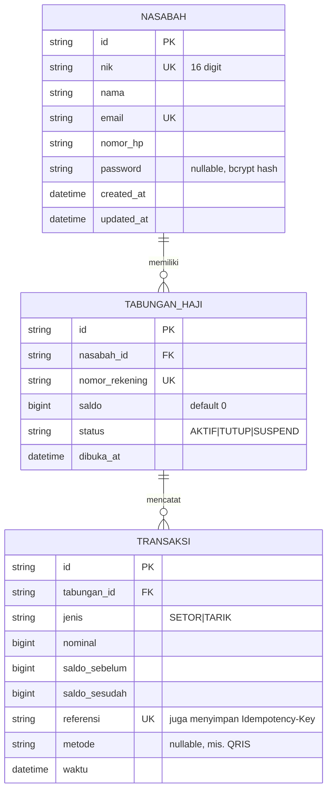

# Arsitektur

## Struktur Folder

```
TabunganHaji/
├── docs/                        # Dokumentasi (folder ini)
├── prisma/
│   ├── schema.prisma            # Definisi model & datasource
│   └── migrations/              # Riwayat migrasi SQL
├── exports/                     # Output CSV laporan (di-ignore git, dibuat saat export)
├── src/
│   ├── index.ts                 # Entry point: setup Express, middleware global, mount routes
│   ├── generated/prisma/        # Prisma Client hasil generate (di-ignore git)
│   ├── lib/
│   │   ├── prisma.ts            # Singleton PrismaClient (+ global omit password)
│   │   ├── jwt.ts               # Sign & verify JWT
│   │   └── tokenBlocklist.ts    # Blocklist token in-memory (logout)
│   ├── middleware/
│   │   └── auth.middleware.ts   # requireAuth (proteksi endpoint)
│   ├── types/
│   │   ├── express.d.ts         # Augmentasi Express.Request.auth
│   │   └── shims.d.ts           # Deklarasi lokal jsonwebtoken & bcrypt
│   ├── scripts/
│   │   └── exportLaporanBulanan.ts   # Script export CSV bulanan
│   └── modules/
│       ├── auth/                # login, logout
│       ├── nasabah/             # CRUD nasabah + registrasi
│       ├── tabungan/            # buka rekening, status, estimasi, dll
│       └── transaksi/           # setor, tarik, mutasi, listing
├── package.json
├── tsconfig.json
└── prisma.config.ts
```

## Pola Berlapis (Layered) per Modul

Setiap domain di `src/modules/<domain>/` mengikuti pola yang sama:

```
request → route → controller → service → Prisma → PostgreSQL
                      │            │
                   schema      (business logic)
                  (validasi)
```

| Berkas | Tanggung jawab |
|---|---|
| `*.route.ts` | Mendaftarkan path HTTP, memasang middleware (mis. `requireAuth`) |
| `*.controller.ts` | Validasi input (Zod), memetakan error domain → kode HTTP, membentuk response |
| `*.service.ts` | Logika bisnis & akses database via Prisma |
| `*.schema.ts` | Skema validasi Zod + tipe input turunannya |

**Prinsip:** controller tidak mengakses Prisma langsung; service tidak tahu soal HTTP.
Service melempar `Error('KODE')` (mis. `TABUNGAN_NOT_AKTIF`) yang dipetakan controller ke status HTTP.

## Tech Stack & Keputusan Desain

- **Express 5** — error pada handler async otomatis diteruskan; saat ini belum ada error-hand
  middleware kustom (error tak terduga → 500 default).
- **Prisma 6 + PostgreSQL** — Client di-generate ke `src/generated/prisma`.
- **BigInt untuk uang** — `saldo` & `nominal` bertipe `BigInt` agar bebas kehilangan presisi.
  `src/index.ts` mem-patch `BigInt.prototype.toJSON` agar terserialisasi sebagai string di JSON.
- **Global omit password** — `src/lib/prisma.ts` mengatur `omit: { nasabah: { password: true } }`
  sehingga password tidak pernah ikut terkirim, kecuali query login yang sengaja meng-override.
- **Zod** — validasi di boundary (controller), pesan error berbahasa Indonesia.

## Model Data



### Catatan field penting

- **`Nasabah.password`** — nullable; nasabah lama tanpa password tidak bisa login.
- **`TabunganHaji.nomorRekening`** — unik, di-generate `60` + 8 digit acak (retry bila bentrok).
- **`TabunganHaji.status`** — string (`AKTIF` default). Setor/tarik hanya untuk `AKTIF`.
- **`Transaksi.referensi`** — unik. Untuk setor idempotent, nilai `Idempotency-Key` disimpan
  di kolom ini sehingga replay terdeteksi tanpa migrasi tambahan (lihat [api-reference.md](./api-reference.md)).
- **`saldo_sebelum` / `saldo_sesudah`** — snapshot saldo per transaksi → audit & rekening koran.

## Konvensi Response Error

```json
{ "error": "KODE_ERROR", "message": "pesan ramah pengguna" }
```

Untuk validasi:

```json
{ "error": "VALIDATION_ERROR", "details": { "field": ["pesan"] } }
```

Daftar lengkap kode error ada di [api-reference.md](./api-reference.md#kode-error).
